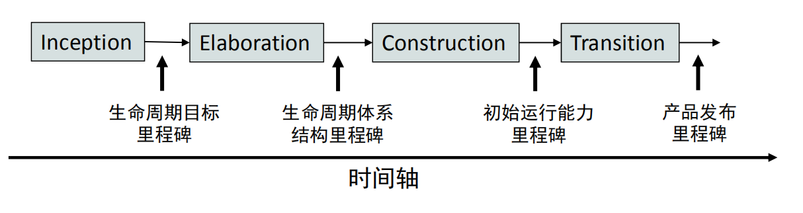

---
layout: default
---
# 16341018 HW3

## 一、简答题
**1.简述瀑布模型、增量模型、螺旋模型（含原型方法）的优缺点**
　      
　　 **从项目特点、风险特征、人力资源利用角度思考**
   
[瀑布模型]( https://en.wikipedia.org/wiki/Waterfall_model)
* **优点：** 
   * 降低软件开发的复杂程度，提高软件开发过程的透明性、提高软件开发过程的可管理性。
   * 推迟软件实现，强调在软件实现前必须进行分析和设计工作。
   * 以项目的阶段评审和文档控制为手段有效地对整个开发过程进行指导，保证了阶段之间的正确衔接，能够及时发现并纠正开发过程中存在的缺陷，使产品达            到预期的质量要求。 

* **缺点：**
   * 强调过程活动的线性顺序。
　 * 缺乏灵活性，尤其无法解决软件需求不明确或不准确的问题。
   * 风险控制能力较弱。
   * 瀑布模型中的软件活动是文档驱动的，当阶段之间规定过多的文档时，会极大地增加系统的工作量。
   * 管理人员如果仅仅以文档的完成情况来评估项目完成进度，往往会产生错误的结论

[增量模型]( https://en.wikipedia.org/wiki/Iterative_and_incremental_development) 
* **优点：**
   * 增强客户对系统的信心；
   * 降低系统失败风险；
   * 提高系统可靠性；
   * 提高系统的稳定性和可维护性
      
* **缺点：**
   * 建立初始模型时，作为增量基础的基本业务服务的确定有一定难度；
   * 增量粒度难以选择

[螺旋模型]( https://en.wikipedia.org/wiki/Spiral_model) 
* **优点：**
   * 强调可选方案和约束条件从而支持软件的重用，有助于将软件质量作为特殊目标融入产品开发之中。
   * 螺旋模型结合了瀑布模型和快速原型方法，将瀑布模型的多个阶段转化到多个迭代过程中，以降低项目的风险
           
* **缺点：**
   * 螺旋模型强调风险分析，但说服外部客户接受和相信分析结果并做出相关反应并不容易，因此螺旋模型往往比较适合内部的大规模软件开发。
   * 风险分析需要耗费相当的成本，因此螺旋模型比较适合投资规模较大的软件项目。
   * 失误的风险分析可能带来更大的风险

**2.简述统一过程三大特点，与面向对象的方法有什么关系？**
　　  
      [RUP](https://en.wikipedia.org/wiki/Rational_Unified_Process)(Rational Unified Process) 是一种基于 UML 的、以构架为中心、用例驱动与风  险驱动相结合的迭代增量过程。它将软件开发过程要素和软件工件要素整合在统一的软件工程框架中，是一个面向对象的程序开发方法论。
　

**3.简述统一过程四个阶段的划分准则是什么？每个阶段关键的里程碑是什么？**
　   
* **RUP 中的软件生命周期在时间维度上被分解为四个顺序的阶段：**

>初始阶段 (Inception)
>
>精化阶段 (Elaboration)
>
>构建阶段(Construction) 
>
>产品交付阶段 (Transition)
　
  
　 
　
　　
* **初始阶段 (Inception)里程碑：**

    生命周期目标 (Lifecycle Objective) 里程碑，包括一些重要的文档，如：项目构想 (Vision)、原始用例模型、原始业务风险评估、一个或者多个原型、原始业务案例等。通过对文档的评审确定用例需求理解正确、项目风险评估合理、阶段计划可行等。

* **精化阶段 (Elaboration)里程碑：**

    生命周期体系结构 (Lifecycle Architecture) 里程碑，包括风险分析文档、软件体系结构基线、项目计划、可执行的进化原型、初始版本的用户手册等。通过评审确定软件体系结构已经稳定、高风险的业务需求和技术机制已经解决、修订的项目计划可行等

* **构建阶段(Construction)里程碑：**

    初始运行能力 (Initial Operational Capability) 里程碑，包括可以运行的软件产品、用户手册等，它决定了产品是否可以在测试环境中进行部署。此刻，要确定软件、环境、用户是否可以开始系统的运行

* **产品交付阶段 (Transition)里程碑：**

    产品发布 (Product Release) 里程碑，确定最终目标是否实现，是否应该开始产品下一个版本的另一个开发周期。在一些情况下这个里程碑可能与下一个周期的初始阶段相重合。

**4.软件企业为什么能按固定节奏生产、固定周期发布软件产品？它给企业项目管理带来哪些好处？**
    
    UP统一过程开发的每次迭代时间原则上都有上限，每次迭代的时间都是固定的，固定节奏可以量化生产过程、个人贡献度、人力资源利用率等数据，有利于更好地监督、控制、调整、评价整个生产。对于公司（生产方）来说，固定节奏开发保证适应市场需求的同时生产可控，对于用户来说，固定节奏的修复，更新更容易产生信赖感。
     
[back](./)

