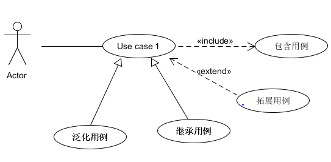
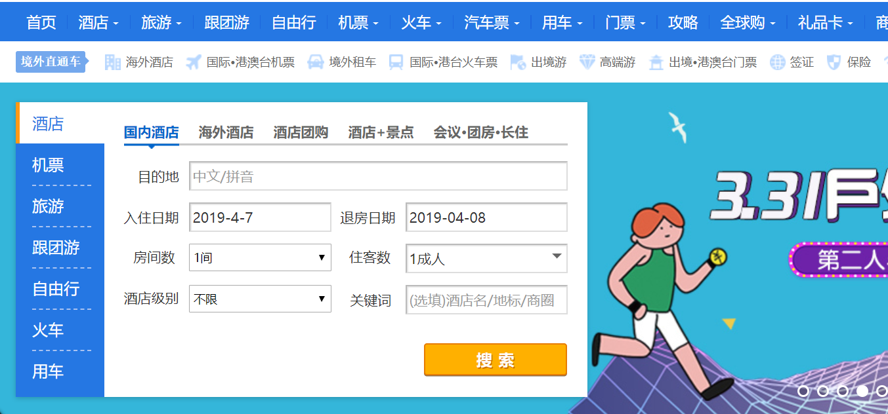
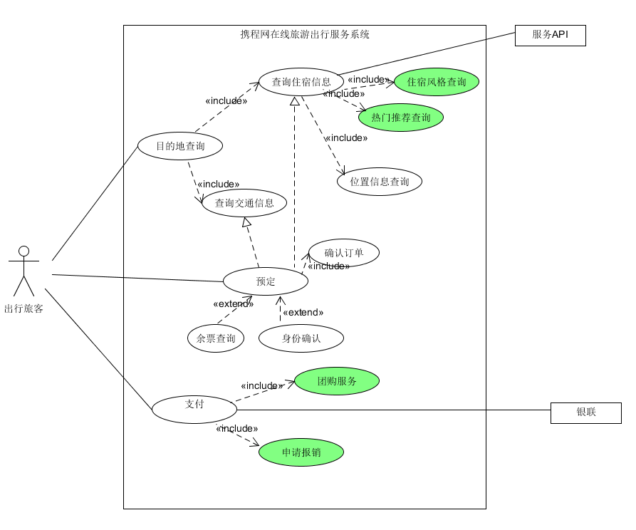
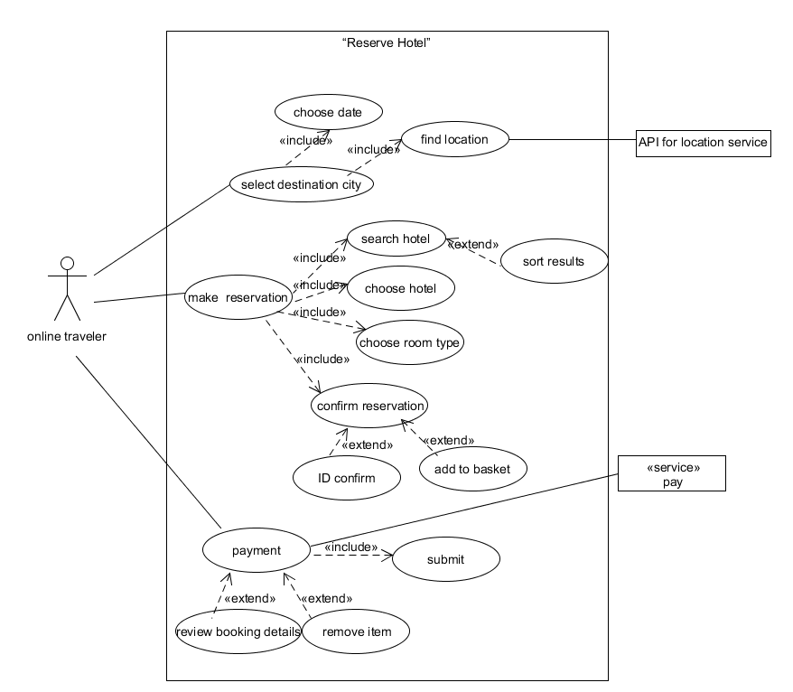

---
layout: default
---
# 16341018 HW4

## 一、简答题
 **1.用例的概念**
     
  *  [用例](https://en.wikipedia.org/wiki/Use_case)是文本形式的情节描述，用以说明参与者（actor）使用某系统以实现某些目标，每个用例提供一个或多个场景，该场景（用例实例）说明了系统如何与参与者互动。
   用例不是图形，是文本。

**2.用例和场景的关系？什么是主场景或 happy path？**
    
   **场景**
        
   * 场景又称为用例实例（use case instance），是使用系统的一个特定情节
   或用例的一条执行路径；用例就是一组相关的成功和失败场景的集合，场景是用
   例的子集。
  
   **主场景&happy path**
   
   * 主成功场景也被称为“理想路径”或“典型流程”，它描述了满足涉众关注点的典型成功路径。通常主场景要保持一定连贯性并将所有条件处理都推延至拓展部分。
           

**3.用例有哪些形式？**
　   
   >  摘要:简洁的一段式概要，通常用于主场景
   >
   >  非正式：非正式的段落格式用几个段落覆盖不同的场景
   >
   >  详述：详细编写所有步骤及各种变化
    
**4.对于复杂业务，为什么编制完整用例非常难？**

 * 对于复杂的业务，需求难以把控，系统复杂庞大且可能涉及多个子系统，参与对象多样，要讨论该系统的完整用例和场景将非常困难且成本较高。
 
**5.什么是用例图？**

 * 用例图是一种系统语境图(context diagram)，用例图能够展示系统边界、位于边界之外的事物以及系统如何被使用。用例图可以作为沟通的工具，用以概括
 系统及其参与者的行为。
 
 
**6.用例图的基本符号与元素？**

 *   用例图包括参与者(Actor)、用例(Use case)、关联关系(Association)、包含关系（Include）、拓展关系(Extend)和泛化关系(Generalization)
 
      
        
        
**7.用例图的画法与步骤**
 *   确定用例、系统
 *   识别参与者
 *   识别参与者和用例间的关系
 *   作图

**8.用例图给利益相关人与开发者的价值有哪些？**
 *   软件开发时无论使用面向对象方法还是其他方法都一定要明确需求，分析典型用例是开发者准确、迅速的了解用户要求最常用、最有效的办法，用例重视文本，
 用例图更直观简洁，可以方便开发者与利益相关人一起剖析系统的功能和需求。用例图可以很好的表示出系统的功能或服务，并且明确地显示出系统中的用户和用例之间的关系。

 
## 二、建模练习题（用例模型）

 * 选择2-3个你熟悉的类似业务的在线服务系统（或移动 APP），如定旅馆（携程、去哪儿等）、定电影票、背单词APP等，分别绘制它们的用例图。并满足以下要求：
      * 请使用用户的视角，描述用户目标或系统提供的服务
      * 粒度达到子用例级别，并用 include 和 extend 关联它们
      * 请用色彩标注出你认为创新（区别于竞争对手的）用例或子用例
      * 尽可能识别外部系统和服务 
      
      
                              [携程网](https://www.ctrip.com/?sid=155952&allianceid=4897&ouid=index)
          
   ### 用例图练习：
         
     
         出行用例图

   ### 然后，回答下列问题：
  
   **1.为什么相似系统的用例图是相似的？**
       
   *    相似系统面对相似的参与者和相似的需求与架构设计，其产生的场景和用例大部分都有相近之处。有些系统所依赖的子系统也是业界通用的。
          
   **2.如果是定旅馆业务，请对比 [Asg_RH](https://sysu-swsad.github.io/swad-guide/material/Asg_RH.pdf) 用例图，简述如何利用不同时代、不同地区产品的用例图，展现、突出创新业务和技术**
   ### Asg_RH用例图
      
        
    *   不同时代、不同地区会面临不同的需求、不同的技术（系统），但相似的业务都会有相近的设计和架构。用例图体现的创新往往体现在新颖的场景实现上，典型的用例场景满足参与者最基本、最紧要的交互，创新必须在基础用例之上进行。针对不同时代、不同地区产生的业务范围、类型等微妙的变化，用例图可以根据用例来构造创新设计，在展现业务的同时体现技术架构的规划。
    
   **3.如何利用用例图定位创新思路（业务创新、或技术创新、或商业模式创新）在系统中的作用**
    * 用例图主要反映参与者在实际场景中与系统的交互过程，创新技术反映在系统功能的高效强大或功能性复杂，参与者可以完成更多事务，创新思路反映到用例图中就是具体的场景。
          
   **4.请使用 SCRUM 方法，选择一个用例图，编制某定旅馆开发的需求（backlog）开发计划表**
      * Asg_RH: backlog
          
      |ID     |Title           |Est      |Iter      |Imp     |How to demo      |
      |:------|:---------------|:--------|:---------|:-------|:----------------|
      |1      |搜索目的地         |25         |2          | 90       |输入目的地、日期，页面显示出可选地址                 |
      |2      |预定酒店         |30           |3          | 100       |搜索酒店、选择酒店和房间类型，按价格、星级或字母表顺序排序搜索结果|
      |3      |确认订单          |15         |2          | 80       |用户填写入住信息和要求后显示检索结果是否匹配并等待用户确认，确认后显示预定细节和付款选项|
      |4      |付款             |10         |2        | 60       |选择付款方式，用户付款|
          
   **5.根据任务4，参考[使用用例点估算软件成本](https://www.ibm.com/developerworks/cn/rational/edge/09/mar09/collaris_dekker/index.html)，给出项目用例点的估算**
   * Ivar Jacobson，用例的发明者，将用例事务描述成从用户到系统，再到用户的“环形路线”；在系统等待一个新的输入时事务就完成了。4换句话说，在一次事务中，用户运行输入系统的一些操作。此时系统发生反应。它处理输入并将处理的结果返回给用户。当用户对结果做出反应时，一个新的事务开始了，它反过来又可以作为系统的输入。
   ####  用例点估计
    
     |类别     |用例数       |权重 |结果|
     |:--------|:-----------|:----|:------|
     |简单用例|3           | 1   | 3    |
     |一般用例  |10           |2   |20    |
     |复杂用例  |2          |3   | 6   |
     
    ####  用例复杂度划分
    *   简单用例：1 到 3 个事务，权重=5
    *   一般用例：4 到 7 个事务，权重=10
    *   复杂用例：多于 7 个事务，权重=15
    
     |类别     |用例数       |事务权重 |结果|
     |:--------|:-----------|:----|:------|
     |简单用例|3           | 5   | 15    |
     |一般用例  |10           |10   |100    |
     |复杂用例  |2          |15   | 30    |
     
    
[back](./)

