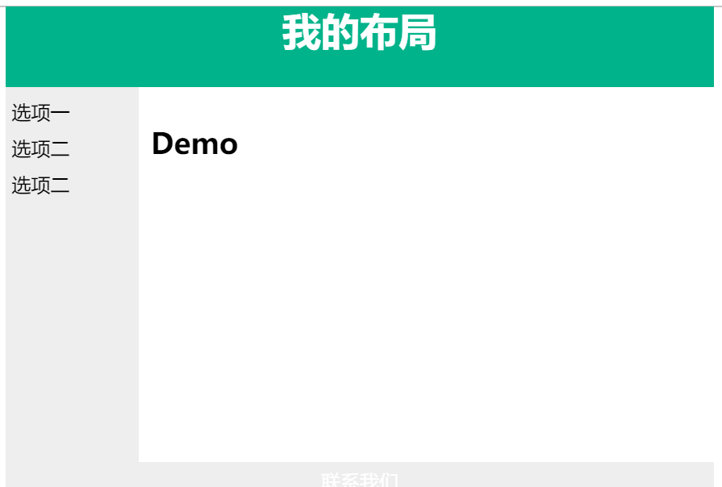

# 我的UI工作小结(Vue.js+ElementUI)

## 引言
   小组分工明确非常重要，不过这也同时意味着每个人必须尽到充分的输出，
这学期我在项目中担任**UI**（``UI``的全称是'用户接口（``User Interface``）'，至此我对这个称谓已有所体会…）。
UI这个位置很神秘，好的UI可以让有所欠缺的项目得到表现，失败的UI会让一个**非常优秀**的项目失去优势……~~**（是我的锅）**~~，

## 开始工作
  我的想法是UI在每一轮迭代中应该最先搭建好``html``布局并在代码合并后调整``css``参数，这样前端其他成员才方便进行``js``脚本
编码和后端服务对接等任务，之后再参与测试和其他多项任务的编码。我在项目开发中写``html``时就会发现：
使用表单标签``<form></form>``比一个个把``<input>``放进``

``要科学得多，又或者在``css``里面设置``width``或``height``到底是
百分比好还是设置``px``、``rem``好…

### 0.和产品经理商量原型
   我觉得软件项目的不确定性就在于此，如果看不到原型相信凭空设计一个页面对UI设计者来说会非常困难，因为原则上绝不能违背需求，
UI设计不能凭主观审美来驱动。原型设计可以帮助UI了解到这个页面需要操作的具体数据和必须展示的必要栏目，同时一些页面跳转等非常
重要的交互逻辑需要提前考虑清楚。
 
### 1.考虑第三方组件库
 
 - [iView](http://v1.iviewui.com/)
    
 - [Element](https://element.eleme.cn/#/zh-CN/component/installation)
   
   原生的``html``标签渲染得到的组件真的不好看，对一个需要强调用户体验和实际功能的产品不太友好，有些组件库
  自带的主题或内置的响应信息非常完善，会减轻很多前端压力，辅助敏捷开发。
  iView和elementUI都是轻量级、易于web网站快速成型的桌面端组件库，我们小组用的是Element(其实组员都觉得Element的设计
  更切合移动端。 **~~还是我的锅~~**)
  
### 2.尝试一个布局 
 
 ~~~html
#!/html

<!DOCTYPE html>
<html>
<head>

</head>

<body>

<h1>我的布局</h1>

选项一 
选项二 
选项二 

<h2>Demo</h2>

联系我们

</body>
</html>

~~~

``html``可以在标签中套标签，这需要对DOM的基本认识才不会在多样的布局设置中混乱，然后像我一样找不到
``class、id``对应在``style``中的``css``在哪里

### 3.规划组件
 有了布局后，基本确定在哪些“框”内要放哪些东西了，接下来就要考虑组件的问题，常见的组件可以参见[w3school](http://www.w3school.com.cn/html/index.asp)
 在``Vue``项目实战中，还可以考虑把那些路由（``router``）下的子组件或父组件结合起来定义更丰富的设计。
 前端其实有点像在'挖坑'等后端来填数据的模式，有了组件，就需要有代码能获取后端的数据了。比较核心的业务逻辑是需要后端来判断的。
 前端需要和后端积极交流，因为API的设计与前端组件和函数的相性有时候不是那么好。
 
### 4.代码组织
  在``Vue``架构中，我们小组采用的写法是:
  ~~~html
       <template>
           ……
        </template>
     
        
  ~~~      
  这样的“三段式”结构，实际上也可以把``style``里的东西放进一个公共样式文件夹，尤其是````
  中的函数，``Vuex``提供了很好的规划方案如``store``等等。
  前端有很多设计方面的编码会非常冗长，并且有时候会涉及到大量复用，我认为其实建立公共的资源文件夹是有必要的。
  
## 总结
   说实话我这个UI并没有起到为项目锦上添花的作用，反而因为我拙劣的操作使整个项目的页面有种说不出的难受的感觉，但这次项目的
  经验对我真的十分重要，尤其是这样的前后端分离开发模式还有与队友的合作沟通，使我学到很多东西，我希望下次再做到前端时，能
  让我的队友和经理满意吧。
  
### 学习链接
   
   [W3school](http://www.w3school.com.cn/html/index.asp)
   
   [Vue.js](https://cn.vuejs.org/)
   
   [Vue/javascript菜鸟教程](https://www.runoob.com/vue2/vue-tutorial.html)
  
        

 

